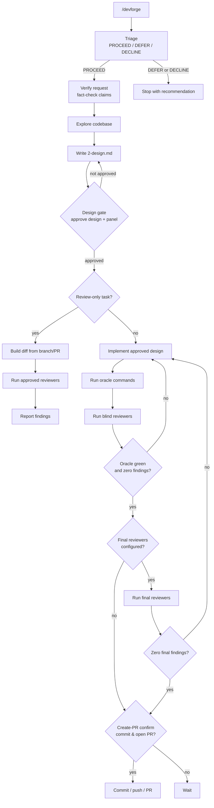

# devforge

devforge is a Claude Code plugin for running coding work through a controlled,
human-gated loop. `/devforge <task>` separates product triage, request verification,
design, implementation, review, tests, and create-PR approval into durable files under
`.devforge/`.

The important property is reviewer independence: reviewers judge the diff and oracle
output, not the implementer's claim or each other's findings.

## Flow



```text
/devforge <task>
  triage product decision              (no gate; stops only on DEFER/DECLINE)
  verify request + explore + design -> DESIGN GATE: review + accept or revise + panel
  implement -> oracle -> blind reviewers -> final reviewers
                                        (loop until zero findings, including nits)
  create-PR confirm (plain chat)    -> commit / PR
```

There is one hard gate before source edits: the **design gate**. Triage is deliberately
cheap and continues into design unless it recommends `DEFER` or `DECLINE`. Creating the PR is
a plain chat confirmation for `"commit & open PR?"`, not a second plan-mode gate.

At the design gate, devforge writes `_panel.json` so each run gets the right reviewer
set for its risk: a small bug can use a small panel, while a core or public-contract
change can use the full roster. The design itself stays short, about one page, and
lists only major changes.

Review-only work is first-class. For a task like "review PR/branch X", devforge runs
triage, design, the approved review panel against the existing diff, and a findings
summary. It only enters the implementation loop if you ask it to fix those findings.

## Commands

- `/devforge <task>` starts a new run.
- `/devforge` resumes the run recorded in `.devforge/_state.json`.
- `/devforge-approve-design` is the human-only command for approving
  `.devforge/2-design.md` and `.devforge/_panel.json` (records the panel and writes the marker).
- `/devforge-approve-create-pr` is the human-only fallback for recording approval
  before commit, push, and PR creation.

The design gate is generic and portable: devforge presents `2-design.md` and the panel and waits
for one of two human-driven outcomes. **Approve** — a chat "yes" or `/devforge-approve-design` —
writes `_design.approved` and proceeds. **Revise** — any change request — re-runs the architect and
re-presents, iterating until you approve. For any agent that has a plan mode (Claude Code, Cursor,
Codex, …), `plan_mode_gate: true` (the default) presents this through plan mode as an adapter:
accepting the plan is Approve, rejecting or editing it is Revise; if the plan tool errors or is
unavailable (remote, headless, web sessions) it falls back to the chat gate. The agent never self-approves — a plan-tool error or a "continue" message is
never approval. Creating the PR uses a chat yes/no or `/devforge-approve-create-pr`. The on-disk
`_design.approved` / `_create_pr.approved` markers are the only approval signals.

## Install

```text
/plugin marketplace add jirispilka/devforge
/plugin install devforge@devforge
```

For local development, load the plugin directory directly:

```bash
claude --plugin-dir /path/to/devforge/.claude
```

On claude.ai/code, attach this repo. In another repo, copy `.claude/skills/` or install
the plugin. Use the commands without a `devforge:` prefix.

### Prompt reads during a run

During a run, devforge reads engine files under `.claude/skills/_vendored/` as
instruction text. These read-only prompts are expected.

If you copied `.claude/skills/` into your repo or attached this repo, allowlist the
prompt reads in `.claude/settings.json`:

```json
{ "permissions": { "allow": ["Read(.claude/skills/_vendored/**)", "Read(.claude/skills/devforge/**)"] } }
```

When installed as a plugin, the files live under the plugin path, so that glob will not
match. Approve the prompts once in that environment.

## Files

Run data lives in `.devforge/`; plugin tooling lives in `.claude/skills/`.

Human-facing files:

- `.devforge/1-triage.md`: product decision, complexity, and approach sketch.
- `.devforge/2-design.md`: approved implementation or review scope.

Internal files:

- `.devforge/_user_request.md`: raw task text.
- `.devforge/_verified_task.md`: verified task with corrected current references.
- `.devforge/_request_fact_check.md`: evidence ledger for request claims.
- `.devforge/_panel.json`: approved reviewer panel and iteration limits.
- `.devforge/_state.json`: resumable phase and iteration state.
- `.devforge/_progress.md`: run log and resolved configuration notes.
- `.devforge/_design.approved`, `.devforge/_create_pr.approved`: human approval markers.
- `.devforge/iter-N/`: per-iteration `claim.md`, review files, diff, and test output.

### Why one file per stage

The files are not bookkeeping; they are the context-routing mechanism. Each stage writes
one file, and each role reads only the files it needs. The implementer reads the
distilled `_verified_task.md`, not the raw `_request_fact_check.md` evidence. Reviewers
judge the diff against `2-design.md` and remain blind to the implementer's `claim.md`
and to peer reviews.

That split is what makes a multi-reviewer panel produce independent signal. Collapsing
the run into one shared context would either pollute each role or break reviewer
independence.

Regenerable files are ignored (`iter-*/diff.patch`, `iter-*/test-results.txt`). Durable
evidence is kept with the branch.

## Configuration

Stages are configured in `.devforge/config.json`; defaults ship beside the skill in
`.claude/skills/devforge/config.default.json`. The base registry maps each `use` name to
a vendored engine under `.claude/skills/_vendored/`.

Default roster:

```json
{
  "stages": {
    "verify_request": { "use": "brainstorming", "model": "opus" },
    "architect": { "use": "writing-plans", "model": "opus" },
    "implementer": { "use": "feature-dev", "model": "opus" },
    "reviewers": [{ "use": "staff-review", "model": "sonnet" }],
    "final_reviewers": [
      { "use": "thermonuclear", "model": "sonnet" },
      { "use": "code-review", "model": "sonnet" }
    ]
  },
  "oracle": { "commands": [] },
  "limits": { "inner_iterations": 3, "final_review_rounds": 2 },
  "plan_mode_gate": true
}
```

Use finite, non-mutating oracle commands such as type checks, lint checks, builds, unit
tests, and targeted integration tests. Avoid dev servers, watchers, fixers, cleanup
commands, inspectors, and eval workflows.

More detail:

- Config reference: [docs/devforge-config.md](docs/devforge-config.md)
- Vendored engine provenance: [VENDORED.md](VENDORED.md)

## Vendored engines

devforge vendors upstream stage engines (`brainstorming`, `writing-plans`,
`feature-dev`, `staff-review`, and `code-review`) under `_vendored/` so a fresh clone or
plugin install works without extra plugin dependencies.

Vendored engines are named `ENGINE.md`, not `SKILL.md`, so Claude Code does not register
them as slash commands. The registry's `scope` field adapts each engine to devforge's
file protocol. See [VENDORED.md](VENDORED.md).
